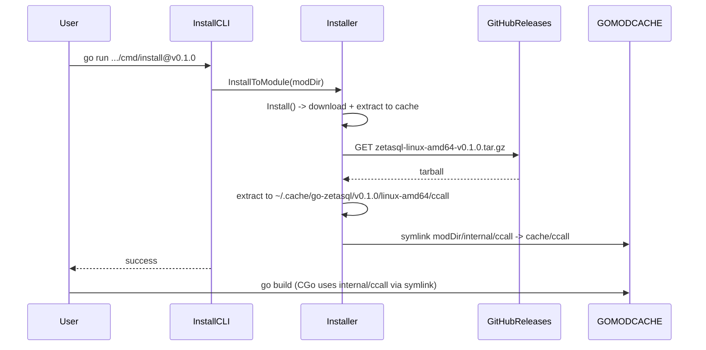

# GoogleSQL installer and pre-built releases

## Current state

- **Build flow**: [internal/cmd/updater](internal/cmd/updater) builds GoogleSQL via Docker + Bazel, then `go run main.go` (updater) copies from `cache/` (external deps + Bazel output) into [internal/ccall](internal/ccall). That tree is committed by the [update-upstream](.github/workflows/update-upstream.yml) workflow.
- **Consumption**: All CGo packages under [internal/ccall/go-zetasql](internal/ccall/go-zetasql) use `#cgo` directives with **relative paths** (e.g. `-I../../..`, `-I../../../protobuf`). The compiler therefore expects the full `internal/ccall` tree (absl, icu, protobuf, re2, zetasql, etc.) to exist at that path relative to the package.
- **playwright-go pattern** ([run.go](https://github.com/playwright-community/playwright-go/blob/main/run.go)): Versioned driver; `DownloadDriver()` fetches a zip from CDN for `GOOS/GOARCH`, extracts to a cache dir (e.g. `~/.cache/ms-playwright-go/<version>`); `Command()` runs the driver from that cache. No modification of the module on disk.

## Repo layout change (no backward compatibility)

- **Move `internal/cmd` to `cmd`**: All CLI and tooling under `internal/cmd` moves to repo-root `cmd/`. Concretely:
  - `internal/cmd/updater` -> [cmd/updater](cmd/updater) (Bazel + Docker + copy-to-ccall). Submodule stays under the updater: `cmd/updater/zetasql`.
  - `internal/cmd/generator` -> [cmd/generator](cmd/generator) (bridge/codegen). It references `internal/ccall` for lib paths; those imports stay as `github.com/vantaboard/go-googlesql/internal/ccall/...`.
  - New installer CLI: [cmd/install](cmd/install) (playwright-style install binary).
  - Update [.gitmodules](.gitmodules): change submodule path from `internal/cmd/updater/zetasql` to `cmd/updater/zetasql`. In updater code, `repoRootDir()` becomes two levels up from package dir (e.g. `filepath.Join(pkgDir(), "..", "..")`) so it still points at repo root.
- **No backward compatibility**: Do not keep committing `internal/ccall`. Require the installer (or explicit “build from source” flow) for every build. This keeps the architecture simple and the repo small.

## Design choices

1. **Artifact format**: Pre-built artifact = tarball of the **entire** `internal/ccall` tree for one platform. Same layout as today so existing `#cgo` paths keep working with no changes to hundreds of bind files.
2. **Where the artifact lives at build time**: CGo resolves paths at compile time relative to the package. So `internal/ccall` must exist **inside the module directory** (e.g. under `GOMODCACHE/.../go-zetasql@vx.y.z/`). The installer will either:

   - **Symlink**: Extract to `~/.cache/go-zetasql/<version>/<goos>-<goarch>/ccall`, then create `internal/ccall` in the module dir as a symlink to that cache dir, or
   - **Copy**: Extract into the module’s `internal/ccall` (simpler, but duplicates data and writes into GOMODCACHE).

Symlink is preferable (single copy, smaller disk use); document that GOMODCACHE must support symlinks (default does).

3. **Versioning**: Tie artifacts to the **go-zetasql module version** (e.g. `v0.1.0`). Optionally encode upstream GoogleSQL tag in the tarball name or a manifest for debugging. Download URL pattern: e.g. GitHub release asset `zetasql-<goos>-<goarch>-v<version>.tar.gz`.
4. **Fallback**: Keep the existing “build from submodule” path (Docker + updater) for contributors or when a pre-built artifact is unavailable (e.g. new platform or custom build).

## Implementation plan

### 1. Installer package (playwright-style API)

- **Location**: New package, e.g. `github.com/vantaboard/go-googlesql/install` (or under `internal/installer` if you want it non-importable by users).
- **Types and API**:
  - `InstallOptions`: `CacheDir`, `Version` (default from module or constant), `BaseURL` (default GitHub releases or env `ZETASQL_DOWNLOAD_BASE_URL`), `SkipIfPresent`.
  - `Installer` (or `Driver`-style name): holds options and version.
  - `Install() error`: resolve cache dir; if SkipIfPresent and cache dir has correct version, return nil; else get download URL for `runtime.GOOS`/`runtime.GOARCH`, download tarball, verify (checksum optional), extract to cache.
  - `InstallToModule(modDir string) error`: after `Install()`, ensure `modDir/internal/ccall` exists: remove existing `internal/ccall` if present, then create symlink from `modDir/internal/ccall` to `<cache>/ccall` (or copy if symlink fails / not supported).
  - Helper to **resolve module dir** for `github.com/vantaboard/go-googlesql`: run `go list -m -f '{{.Dir}}' github.com/vantaboard/go-googlesql` (or use `GOMODCACHE` + module path + version from `go list -m`). Handle the case where the current module is go-zetasql (e.g. development) vs. a consumer.
- **Download logic**: Mirror playwright’s `downloadDriver`: try URLs in order (e.g. base URL + `zetasql-<platform>-v<version>.tar.gz`), `http.Get`, validate status 200, read body, extract (e.g. `archive/tar` or `compress/gzip`). Optional: SHA256 checksum file per artifact and verify after download.
- **Cache layout**: e.g. `CacheDir/<version>/<goos>-<goarch>/ccall/` (absl, icu, go-zetasql, protobuf, …). Version can come from a constant in this package, or from `go list -m -f '{{.Version}}' github.com/vantaboard/go-googlesql` when running from a module context.
- **Platform matrix**: Same as playwright-style: `linux`, `linux-arm64`, `darwin`/`mac`, `mac-arm64`, `windows` (if you add Windows support later). Map `runtime.GOOS`/`runtime.GOARCH` to artifact name.

### 2. CLI: `cmd/install` (or `cmd/zetasql-install`)

- **Behavior**: Similar to [cmd/playwright/main.go](https://github.com/playwright-community/playwright-go/blob/main/cmd/playwright/main.go): parse flags (optional: `-version`, `-cache-dir`, `-skip-if-present`), create installer with options, call `Install()` then `InstallToModule(modDir)` where `modDir` is the resolved go-zetasql module directory.
- **Usage**: `go run github.com/vantaboard/go-googlesql/cmd/install@v0.1.0` (or `go install` then `zetasql-install`). Document that this prepares the module for building (creates/symlinks `internal/ccall`).

### 3. GitHub CI/CD: build and publish pre-built artifacts

- **When**: On release (e.g. when [release](.github/workflows/release.yml) creates a tag) or as a separate workflow that runs on tag push `v*`.
- **What**: For each supported platform, produce the `internal/ccall` tree and upload it as a **release asset**.
  - **Linux amd64**: Reuse existing updater flow. Job: checkout at tag, run [cmd/updater](cmd/updater) (Docker build + export + `go run main.go`), then tar the resulting `internal/ccall` (from repo root) as `zetasql-linux-amd64-v<version>.tar.gz` and upload via `actions/upload-release-asset` or `softprops/action-gh-release`.
  - **Darwin (amd64/arm64)**: Either (a) run the same Bazel/updater flow on `macos-latest` (and macos-arm) if you add a non-Docker path (Bazel + deps installed on the runner), or (b) defer darwin to a follow-up and ship only linux-amd64 initially. The updater’s Dockerfile (under `cmd/updater/`) is Linux-only; darwin would require a macOS-specific build (Bazel on Mac or a second Dockerfile for cross-compilation, which is non-trivial for GoogleSQL).
- **Workflow shape**: One job that (1) determines version from tag, (2) builds linux-amd64 artifact (Docker + export + updater), (3) creates or uses the GitHub release and uploads `zetasql-linux-amd64-v<version>.tar.gz`. Optionally a matrix for future platforms.
- **Tarball layout**: Unpacking the tarball should yield a single top-level dir `ccall/` (or the contents of `ccall/` at root) so that the installer can extract to `<cache>/<version>/<platform>/` and have `<cache>/<version>/<platform>/ccall/` with the expected structure.

### 4. Repo policy for `internal/ccall` (install-only, no backward compatibility)

- Stop committing `internal/ccall`. Add `internal/ccall` to `.gitignore`. Every build (CI for go-zetasql itself, or consumers) runs the installer first (or uses a pre-run that populates `internal/ccall` from cache or from the release tarball).
- Update [update-upstream](.github/workflows/update-upstream.yml) to use [cmd/updater](cmd/updater) and so it no longer commits `internal/ccall`; instead it can build and upload a candidate artifact or open a PR that triggers the artifact build.

### 5. Documentation and UX

- **README**: Add an “Installation” section: to build go-zetasql (or a project that depends on it), run once: `go run github.com/vantaboard/go-googlesql/cmd/install@latest` (or the version you use). Optionally set `ZETASQL_CACHE_DIR` or `ZETASQL_DOWNLOAD_BASE_URL`. If no pre-built artifact exists for your platform, document the “build from source” path (submodule + Docker + updater).
- **CI for consumers**: In [go.yml](.github/workflows/go.yml) (or a separate “test with installer” job), before `go test`: run the install command so the module has `internal/ccall` from the cached artifact when testing. Document that building from source uses [cmd/updater](cmd/updater) (Docker + Bazel + updater).

### 6. Version constant and optional checksum

- In the installer package, define a version constant (e.g. `ZetasQLInstallerVersion`) or read from module at runtime. For release assets, use the same version as the tag.
- Optional: Publish a small manifest or checksum file (e.g. `zetasql-linux-amd64-v0.1.0.sha256`) next to each tarball and verify in `Install()`.

## Summary diagram

## Files to add or change

| Area | Action |

|------|--------|

| Repo layout | Move `internal/cmd` to `cmd`: `internal/cmd/updater` -> `cmd/updater`, `internal/cmd/generator` -> `cmd/generator`. Update [.github/workflows/update-upstream.yml](.github/workflows/update-upstream.yml) (paths, `working-directory`, submodule path `cmd/updater/zetasql`), updater `repoRootDir()`/paths if needed, and generator imports (they stay as `internal/ccall`). |

| New package | Add `install/` (or `internal/installer/`) with installer types, `Install()`, `InstallToModule()`, download + extract, platform URL mapping, cache dir resolution. |

| New CLI | Add `cmd/install/main.go` that resolves module dir, creates installer, calls `Install()` and `InstallToModule()`. |

| CI | New workflow (e.g. `build-release-assets.yml`) or extend `release.yml`: on tag, build linux-amd64 `internal/ccall` via `cmd/updater`, tar it, upload as release asset. Update update-upstream to use `cmd/updater` and stop committing `internal/ccall`. |

| Repo policy | Add `internal/ccall` to `.gitignore`; require installer (or explicit build-from-source with `cmd/updater`) for every build. |

| Docs | README section on running the installer and building from source with `cmd/updater` when no artifact exists. |

## Risks and follow-ups

- **Platform coverage**: Initial implementation can ship only **linux-amd64**; add darwin/arm64 (and optionally windows) when you have a repeatable build path for those platforms.
- **GOMODCACHE write**: Installing into the module dir under GOMODCACHE requires write access there; `go run .../cmd/install` is typically run by the user who owns that dir. CI must run the install step with the same user that runs `go build`.
- **Breaking change**: Moving `internal/cmd` to `cmd` and no longer committing `internal/ccall` breaks existing clones; document in release notes and README that users must run the installer (or build from source with `cmd/updater`) before building.